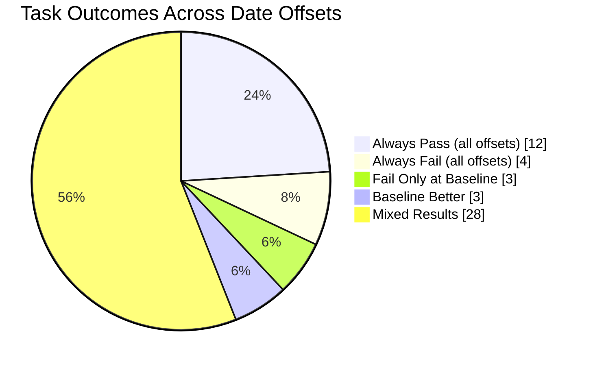

# Time Ablation Experiments on tau2-bench

This fork of [tau2-bench](https://github.com/sierra-research/tau2-bench) investigates whether LLM agent performance varies based on the temporal context of dates in prompts.

## Hypothesis

**Do LLMs perform differently on identical tasks when dates are shifted into the past or future?**

We hypothesize that models may exhibit different levels of caution or confidence depending on whether dates appear "real" (close to training data) versus "hypothetical" (far future/past). This could manifest as:
- More conservative behavior for dates near the model's training cutoff
- Greater willingness to take actions for clearly hypothetical dates
- Different tool-calling patterns based on perceived temporal context

## Experimental Setup

### Framework

[tau2-bench](https://github.com/sierra-research/tau2-bench) is an agent evaluation benchmark where an LLM agent handles customer service tasks in a simulated environment. The agent interacts with:
- A **user simulator** (another LLM playing the customer role)
- A **tool environment** (database of flights, reservations, users)
- A **policy document** (rules the agent must follow)

### Models

| Role | Model | Notes |
|------|-------|-------|
| Agent | Claude Sonnet 4.5 (`claude-sonnet-4-5-20250929`) | The model being evaluated |
| User Simulator | GPT-4.1 (`gpt-4.1`) | Simulates customer behavior per task instructions |

### Domain: Airline Reservation System

The airline domain includes:
- **50 tasks** covering flight changes, cancellations, booking modifications, baggage updates, and policy edge cases
- **3 trials per task** (150 simulations per offset)
- **Pass^3 metric**: Percentage of tasks where all 3 trials succeed (reward ≥ 1.0)

### Date Transformation

Each offset domain is generated by transforming all dates in:

| File | What's Transformed |
|------|-------------------|
| `db.json` | Flight dates, reservation timestamps, user DOBs, passenger DOBs |
| `tasks.json` | Date references in task instructions and evaluation criteria |
| `policy.md` | "The current time is 2024-05-15 15:00:00 EST" timestamp |
| `tools.py` | `_get_datetime()` return value used by agent tools |

The baseline uses **May 15, 2024** as the current date. Offsets shift all dates by the specified number of days while preserving the logical relationships (e.g., a flight "tomorrow" stays "tomorrow").

### Offset Naming Convention

- `airline_offset_p365d` = +365 days (1 year into future → 2025)
- `airline_offset_n730d` = -730 days (2 years into past → 2022)
- `p` = positive (future), `n` = negative (past)

## Key Finding

**The baseline (original 2024 dates) shows the WORST performance across all 15 time offsets tested.**

| Offset | Year | Pass^3 | Avg Reward |
|--------|------|--------|------------|
| -36500d | 1924 | 50% | 0.620 |
| -3650d | 2014 | 50% | 0.640 |
| -1825d | 2019 | 54% | 0.660 |
| -1460d | 2020 | 50% | 0.647 |
| -1095d | 2021 | 46% | 0.627 |
| -730d | 2022 | **58%** | 0.687 |
| -365d | 2023 | 50% | 0.647 |
| **0d** | **2024 (baseline)** | **42%** | **0.560** |
| +365d | 2025 | 48% | 0.620 |
| +730d | 2026 | 52% | 0.640 |
| +1095d | 2027 | 48% | 0.627 |
| +1460d | 2028 | 46% | 0.620 |
| +1825d | 2029 | **60%** | **0.693** |
| +3650d | 2034 | 54% | 0.667 |
| +36500d | 2124 | 48% | 0.633 |

*Model: Claude Sonnet 4.5, 3 trials, 50 tasks, airline domain*

**Key observations:**
- Baseline (2024) is the absolute worst at **42% Pass^3**
- Best performers: **+5 years (2029) at 60%** and **-2 years (2022) at 58%**
- Even extreme offsets (-100yr, +100yr) outperform baseline by 6-8 percentage points
- No monotonic relationship between offset magnitude and performance

## Behavioral Analysis

The baseline agent is **significantly more conservative** than agents operating on shifted dates:

| Offset | Year | Tool Calls/Task | Conv Length |
|--------|------|-----------------|-------------|
| -36500d | 1924 | 8.5 | 30.0 |
| -3650d | 2014 | 8.5 | 29.7 |
| -1825d | 2019 | 8.7 | 29.9 |
| -1460d | 2020 | 8.4 | 29.8 |
| -1095d | 2021 | 8.5 | 30.5 |
| -730d | 2022 | 8.4 | 29.6 |
| -365d | 2023 | 8.4 | 29.4 |
| **0d** | **2024 (baseline)** | **6.9** | **25.6** |
| +365d | 2025 | 7.9 | 28.4 |
| +730d | 2026 | 8.4 | 30.1 |
| +1095d | 2027 | 8.8 | 29.9 |
| +1460d | 2028 | 8.3 | 29.3 |
| +1825d | 2029 | 8.3 | 28.7 |
| +3650d | 2034 | 8.2 | 28.9 |
| +36500d | 2124 | 8.7 | 30.3 |

The baseline model makes **~19% fewer tool calls** (6.9 vs 8.4 avg) and produces **~14% shorter conversations** (25.6 vs 29.6 avg) than other offsets, suggesting earlier task abandonment or more conservative decision-making.

## Case Studies

### Task 32: The Smoking Gun (0% baseline, 100% everywhere else)

This task shows the most dramatic offset effect. The user needs to change a flight from Newark to a nonstop option due to a family emergency.

| Offset | Year | Pass Rate |
|--------|------|-----------|
| All non-baseline | 1924-2124 | **100%** (3/3 trials) |
| **Baseline** | **2024** | **0%** (0/3 trials) |

**What happens at baseline (2024):**
- Agent searches for flights, finds nonstop option HAT041
- User willing to pay up to $100 difference, but fare difference is $234
- Agent immediately transfers to human agent instead of negotiating or exploring alternatives
- Task fails because no reservation update was made

**What happens at other offsets:**
- Agent explores options more thoroughly
- Successfully completes the flight change
- 100% pass rate across all 14 non-baseline offsets

### Task 43: Cancellation Handling (0% baseline, 67% average elsewhere)

Tests agent's ability to correctly identify which flights can be canceled per policy.

| Offset | Pass Rate |
|--------|-----------|
| -3650d (2014) | 100% |
| -730d (2022) | 100% |
| +730d (2026) | 100% |
| +1825d (2029) | 100% |
| **0d (baseline)** | **0%** |

### Task 21: Baseline Outperforms (100% baseline, 11% average elsewhere)

Interestingly, a few tasks show the opposite pattern where baseline performs better:

| Offset | Pass Rate |
|--------|-----------|
| **0d (baseline)** | **100%** |
| -36500d (1924) | 0% |
| +36500d (2124) | 0% |
| Average (non-baseline) | 11% |

This task involves complex multi-step flight changes. The baseline agent's more decisive behavior may help avoid getting stuck in exploration loops.

## Task Distribution (50 tasks, 15 offsets)



| Category | Count | Task IDs |
|----------|-------|----------|
| Always Pass | 12 | 3, 4, 6, 10, 13, 19, 28, 31, 34, 40, 46, 48 |
| Always Fail | 4 | 7, 27, 33, 37 |
| Fail Only at Baseline | 3 | 32, 35, 43 |
| Baseline Better | 3 | 21, 26, 47 |
| Mixed Results | 28 | All others |

**Key insight**: 6% of tasks (3/50) fail exclusively at baseline while passing at other offsets. Another 6% show the opposite pattern. The remaining variable tasks show no clear baseline-specific pattern.

## Visualizations

### Performance Plot


*Generate with: `python -m experiments.time_ablation.cli plot`*

### Task Heatmap


*Generate with: `python -m experiments.time_ablation.cli heatmap`*

The heatmap shows pass rate (green=3/3, yellow=partial, red=0/3) for each task across all date offsets. Tasks are sorted by baseline performance. The baseline row (2024) is outlined in black.

## Possible Explanations

1. **Training data boundary effect**: The model may be more cautious with 2024 dates because they fall near or within its training data, triggering uncertainty about "real" events it might have seen.

2. **Hypothetical framing**: Clearly past (1924) or future (2124) dates may trigger "hypothetical scenario" reasoning, reducing hesitation and encouraging more exploratory behavior.

3. **Confidence calibration**: The model may perceive lower stakes for clearly fictional dates, leading to more decisive action-taking.

4. **Temporal anchoring**: Dates matching the model's "present" understanding may activate different reasoning patterns than dates that are obviously displaced.

5. **Risk aversion asymmetry**: The model might be specifically trained to be cautious about actions in the "present" timeframe to avoid real-world mistakes.

## Running Experiments

```bash
# Install
pip install -e .

# Generate offset datasets
python -m experiments.time_ablation.cli generate --offset-days 365   # +1 year
python -m experiments.time_ablation.cli generate --offset-days -365  # -1 year
python -m experiments.time_ablation.cli generate --offset-days 1825  # +5 years

# Run experiments
python -m experiments.time_ablation.cli run \
  --offsets -36500 -3650 -1825 -730 -365 0 365 730 1825 3650 36500 \
  --num-trials 3 \
  --agent-llm claude-sonnet-4-5-20250929

# Analyze results
python -m experiments.time_ablation.cli analyze

# Generate plots
python -m experiments.time_ablation.cli plot
python -m experiments.time_ablation.cli heatmap
```

## Repository Structure

```
src/experiments/time_ablation/   # Experiment infrastructure
  cli.py                         # Command-line interface
  generate_dataset.py            # Date transformation logic
  run_ablation.py                # Experiment runner
  analyze.py                     # Results analysis
  plot.py                        # Visualization

data/tau2/domains/               # Generated offset domains (15 total)
  airline/                       # Original baseline (2024)
  airline_offset_n36500d/        # -100 years (1924)
  airline_offset_n3650d/         # -10 years (2014)
  airline_offset_n1825d/         # -5 years (2019)
  airline_offset_n1460d/         # -4 years (2020)
  airline_offset_n1095d/         # -3 years (2021)
  airline_offset_n730d/          # -2 years (2022)
  airline_offset_n365d/          # -1 year (2023)
  airline_offset_p365d/          # +1 year (2025)
  airline_offset_p730d/          # +2 years (2026)
  airline_offset_p1095d/         # +3 years (2027)
  airline_offset_p1460d/         # +4 years (2028)
  airline_offset_p1825d/         # +5 years (2029)
  airline_offset_p3650d/         # +10 years (2034)
  airline_offset_p36500d/        # +100 years (2124)

data/simulations/time_ablation/  # Experiment results (15 offsets)
```

## Main Repository

For full tau2-bench documentation, installation instructions, and domain details, see the [main repository](https://github.com/sierra-research/tau2-bench).
