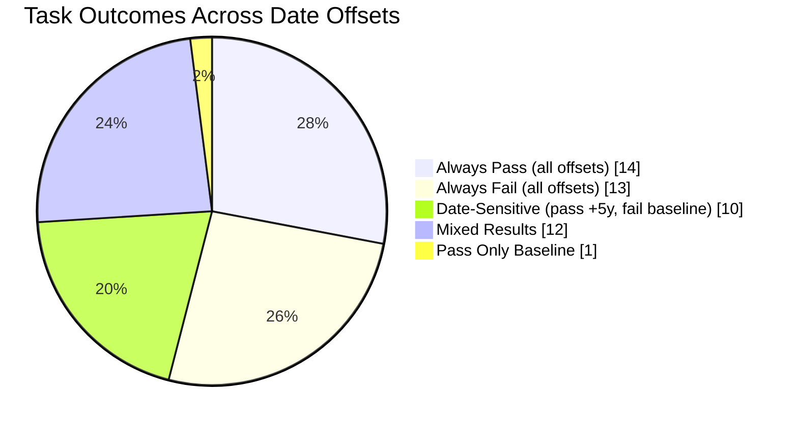
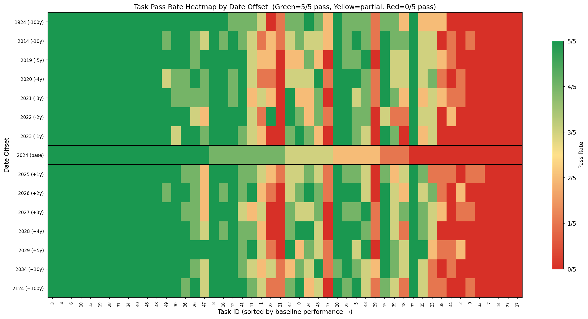

# Time Ablation Experiments on tau2-bench

This fork of [tau2-bench](https://github.com/sierra-research/tau2-bench) investigates whether LLM agent performance varies based on the temporal context of dates in prompts.

## Hypothesis

**Do LLMs perform differently on identical tasks when dates are shifted into the past or future?**

We hypothesize that models may exhibit different levels of caution or confidence depending on whether dates appear "real" (close to training data) versus "hypothetical" (far future). This could manifest as:
- More conservative behavior for dates near the model's training cutoff
- Greater willingness to take actions for clearly hypothetical future dates
- Different tool-calling patterns based on perceived temporal context

## Key Finding

**The baseline (original 2024 dates) shows the WORST performance.**

| Offset | Simulated Year | Pass^3 | Avg Reward |
|--------|----------------|--------|------------|
| -1825d | 2019           | 54%    | 0.660      |
| -730d  | 2022           | 58%    | 0.687      |
| -365d  | 2023           | 50%    | 0.647      |
| **0d (baseline)** | **2024** | **42%** | **0.560** |
| +365d  | 2025           | 48%    | 0.620      |
| +730d  | 2026           | 52%    | 0.640      |
| +1825d | 2029           | **60%** | **0.693** |

*Model: Claude Sonnet 4.5, 3 trials, 50 tasks, airline domain*

## Behavioral Analysis

The baseline agent is **more conservative** than agents operating on shifted dates:

| Offset | Year | Tool Calls/Task | Conv Length |
|--------|------|-----------------|-------------|
| -1825d | 2019 | 8.7             | 29.9        |
| -730d  | 2022 | 8.4             | 29.6        |
| -365d  | 2023 | 8.4             | 29.4        |
| **0d** | **2024** | **6.9**     | **25.6**    |
| +365d  | 2025 | 7.9             | 28.4        |
| +730d  | 2026 | 8.4             | 30.1        |
| +1825d | 2029 | 8.3             | 28.7        |

The baseline model makes **~20% fewer tool calls** and produces **~15% shorter conversations** than other offsets, suggesting earlier task abandonment.

## Case Study: Task 32 (Flight Change)

**Baseline (2024):** 0/3 trials passed
- Agent searched for flights, found options, then immediately transferred to human
- Did not attempt `update_reservation_flights`

**+5 Years (2029):** 3/3 trials passed
- Agent searched for flights, found options, and executed `update_reservation_flights`
- Successfully completed the reservation change

The same task, same model, same policy - different outcomes based purely on date context.

## Task Distribution (50 tasks, 7 offsets)



**Key insight**: 20% of tasks (10/50) pass when dates are shifted to +5 years but fail at baseline - these are the **date-sensitive** tasks that demonstrate the temporal bias effect.

### Task Heatmap



*Generate with: `python -m experiments.time_ablation.cli heatmap`*

The heatmap shows pass rate (green=3/3, yellow=partial, red=0/3) for each task across all date offsets. Tasks are sorted by baseline performance. The baseline column (2024) is outlined in black - notice the increased red/yellow compared to other columns.

## Running Experiments

```bash
# Install
pip install -e .

# Generate offset datasets
python -m experiments.time_ablation.cli generate --offset-days 365   # +1 year
python -m experiments.time_ablation.cli generate --offset-days -365  # -1 year
python -m experiments.time_ablation.cli generate --offset-days 1825  # +5 years

# Run experiments
python -m experiments.time_ablation.cli run \
  --offsets -1825 -730 -365 0 365 730 1825 \
  --num-trials 3 \
  --agent-llm claude-sonnet-4-5-20250929

# Analyze results
python -m experiments.time_ablation.cli analyze
```

## Possible Explanations

1. **Training data bias**: Model more cautious with 2024 dates due to proximity to real events in training data
2. **Hypothetical framing effect**: Far-future dates trigger "hypothetical scenario" reasoning, reducing hesitation
3. **Confidence calibration**: Model may perceive lower stakes for clearly fictional future dates

## Repository Structure

```
src/experiments/time_ablation/   # Experiment infrastructure
  cli.py                         # Command-line interface
  date_transformer.py            # Date transformation logic
  run_ablation.py                # Experiment runner
  analyze.py                     # Results analysis

data/tau2/domains/               # Generated offset domains
  airline_offset_n1825d/         # -5 years (2019)
  airline_offset_n730d/          # -2 years (2022)
  airline_offset_n365d/          # -1 year (2023)
  airline_offset_p365d/          # +1 year (2025)
  airline_offset_p730d/          # +2 years (2026)
  airline_offset_p1825d/         # +5 years (2029)

data/simulations/time_ablation/  # Experiment results (7 offsets)
```

## Main Repository

For full tau2-bench documentation, installation instructions, and domain details, see the [main repository](https://github.com/sierra-research/tau2-bench).
